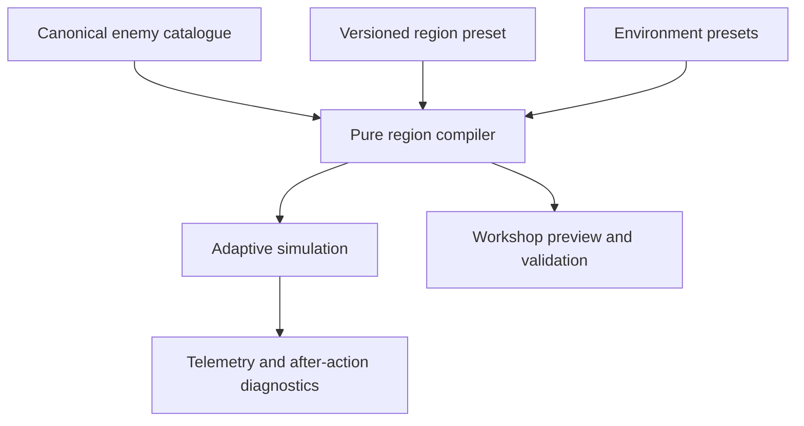

# Region Workshop — Timeline-Driven Level Authoring

Status: **BUILT (slices A–E) — see "Implementation status"**

## Intent

Build an in-game designer tool that lets a designer create, inspect, save, clone,
import, export, and immediately playtest any number of regions without manually
editing TypeScript.

The central view is a table-like timeline from round 1 through the region's
completion round. Each round shows what the enemy is allowed to field, what is
introduced for the first time, which tactics or encounter patterns may be used,
and how much pressure the adaptive procurement system can apply. The tool must
use the complete canonical enemy arsenal: ships, missiles, mines, torpedoes,
artillery, delivery platforms or mounts, tactics, targeting doctrine, and future
implemented enemy content.

This is a **region authoring layer**, not a second combat simulator and not a
parallel copy of the balance data.

## Why this shape

The current code is already strongly data-driven, but region authoring is too
coarse and code-only:

- `src/data/regions.ts` defines region identity, completion round, permitted
  branches, optional debut floors, budget curve, branch ceilings, starting
  state, and geography.
- `src/data/enemyBranches.ts` owns the branch/node/tactic catalogue and global
  gates.
- `src/data/geography.ts` owns the playable water shapes.
- `src/sim/evolution.ts` is the adaptive buyer that chooses how to spend within
  the region's permitted menu.

The workshop should join those systems through references. It must never copy a
missile's damage, a boat's speed, or a tactic's effect into a region file. A
region controls **availability, pacing, composition guardrails, scripted debut
beats, and terrain**. The canonical arsenal continues to control what each enemy
capability actually does.

## Product decisions

These decisions are part of the build, not open questions for implementation.

1. **Rounds are cumulative milestones.** Adding a capability on round 3 makes it
   available from round 3 onward until an explicit removal is authored. The
   designer does not have to repeat the same selections in every later round.
2. **The adaptive enemy remains the default.** The timeline defines the menu and
   pressure envelope; `evolution.ts` still chooses purchases using its existing
   adaptive logic. Scripted encounter beats are optional, explicit, and visually
   distinct from ordinary availability.
3. **Canonical gates remain authoritative.** A region can delay a capability but
   cannot move it earlier than its catalogue gate. The resolved introduction is
   `max(catalogue gate, region introduction)`. Changing a global gate belongs in
   the arsenal data, not in a region preset.
4. **Only implemented content can enter a playable region.** Designed but
   unimplemented entries remain visible in the arsenal browser, marked as such,
   but cannot be added to a runnable preset. There must be no silent no-op.
5. **Built-in regions are templates.** Missile Coast and Home Strait ship
   preloaded, can be opened and inspected, and can be cloned. The packaged
   versions remain read-only in the workshop so an experiment cannot silently
   mutate campaign progression.
6. **Saved drafts are immediately testable.** A locally saved region appears in
   the workshop's playtest selector without requiring a rebuild.
7. **The authored format is portable JSON.** It contains identifiers and values,
   never functions or browser state, so it can later move with the simulation to
   iPhone.
8. **No arbitrary round limit.** The UI adds or removes rounds and virtualizes or
   scrolls the matrix as needed. Validation requires a positive integer, not a
   product-defined maximum.

## Vocabulary

| Term | Meaning |
| --- | --- |
| Arsenal capability | A canonical enemy branch, unit/node, payload, platform/mount, tactic, doctrine rung, or supported encounter pattern. |
| Loadout | A valid combination such as a missile payload plus a compatible launch platform/mount and tactics. |
| Introduction | The first region round on which a capability becomes available. |
| Availability | The resolved set the adaptive enemy may use on a given round. |
| Encounter beat | An optional authored behavior such as a clustered debut, salvo, wave, or sustained stream. |
| Environment preset | A validated playable geography and terrain shape exposed by the workshop. |
| Region preset | A versioned, portable authored definition that compiles into runtime region rules. |

## Experience

### 1. Region library

The workshop opens on a region library table with:

- name and stable ID;
- built-in or custom source;
- environment/shape;
- completion round;
- number of active branches and loadouts;
- validation state;
- last edited time for local drafts;
- actions: **Open**, **Clone**, **Playtest**, **Export**, and **Delete** for custom
  entries.

Primary actions are **New Region** and **Import JSON**. A new region begins from
either Blank, Missile Coast, or Home Strait. Cloning always creates a new ID and
does not preserve campaign unlock links unless the designer adds them.

### 2. Builder shell

The editor has four persistent areas:

1. **Region header** — name, ID, tagline, description, completion round, campaign
   unlock target, completion XP, and validation state.
2. **Environment panel** — shape/preset selector, map preview, lane count, launch
   sites, and validation messages.
3. **Timeline matrix** — the main table, with arsenal/features as rows and rounds
   as columns.
4. **Inspector/drawer** — edits the selected cell, capability, round, or
   encounter beat with type-aware controls.

The desktop/tablet matrix uses sticky row labels and a sticky round ruler. On a
phone, the same data becomes a round-by-round vertical list; no hover, keyboard,
or right-click interaction may be required.

### 3. Timeline matrix

Columns are rounds 1 through N. Rows are grouped and collapsible:

- Pressure: total budget, multiplier/override, and per-branch ceilings.
- Missiles.
- Mines.
- Torpedoes.
- Attack boats and enemy ships.
- Artillery.
- Smoke.
- Electronic warfare.
- Targeting doctrine.
- Encounter beats and warnings.

Cell language:

- a strong leading marker means **introduced this round**;
- a lighter continuous band means **available from an earlier round**;
- a patterned marker means a **scripted encounter beat**;
- a stop marker means **removed after this round**;
- a warning icon means a prerequisite, gate, compatibility, or implementation
  problem.

Example of the density and scanability target (illustrative names only; the
real rows come from the catalogue):

| Capability / rule | R1 | R2 | R3 | R4 | R5 | R6 | R7 | R8 |
| --- | --- | --- | --- | --- | --- | --- | --- | --- |
| Round budget | 186 | 284 | 382 | 480 | 578 | 676 | 774 | 872 |
| Unguided missile loadout | **+** | active | active | active | active | active | active | active |
| Guided missile loadout | — | — | **+** | active | active | active | active | active |
| Clustered salvo beat | — | — | debut | — | scripted | — | scripted | — |
| Mine branch | — | — | — | — | **+** | active | active | active |
| Intel warning | Sky | — | Guidance | — | Mines | — | Escalation | Final |

The matrix is an explanation of the level, not just a spreadsheet skin. A
designer should be able to see the region's teaching sequence, escalation, and
overlaps without opening every cell.

Clicking or tapping an empty cell opens **Add capability** already scoped to that
round. Clicking a filled cell opens its type-aware inspector. Dragging may be
added as a desktop convenience, but click/tap must provide the complete flow.

Round actions:

- insert before/after;
- duplicate round settings;
- copy a selected range;
- clear authored changes from a round;
- add an optional label and player-facing intel warning;
- playtest starting at that round with a deterministic seed.

When a round is inserted or removed, later milestone round numbers shift so the
authored pacing stays attached to its position on the timeline.

### 4. Arsenal browser and loadout composer

The arsenal drawer reads directly from the canonical catalogue and is grouped by
branch. Each entry shows name, kind, earliest global gate, implementation state,
cost, and existing prerequisites. Search and filters cover branch, kind,
implemented/unimplemented, and already-used/unused.

For capabilities that have meaningful component choices, the composer is
ordered:

1. threat/unit;
2. payload or missile type;
3. delivery platform/mount;
4. compatible tactics;
5. targeting/doctrine implications;
6. availability behavior and optional encounter beat.

The current catalogue is primarily branch → node → tactic. Do not fabricate
mount choices in the UI. Add a normalized catalogue relationship only where the
simulation has a real payload/platform distinction. If a missile and its mount
are currently represented as one node, show that node as one complete loadout
until the canonical data is split. Incompatible combinations must never be
offered.

### 5. Adaptive availability versus scripted beats

The inspector must make this distinction explicit:

- **Available** — the adaptive enemy may buy and use the capability, within its
  budget and ceilings.
- **Debut guarantee** — reserve enough of the round envelope to visibly introduce
  the capability, then return remaining spend to the adaptive allocator.
- **Scripted beat** — author an exact supported pattern such as a salvo, cluster,
  wave, or sustained stream. This is intentionally stronger control and is
  labeled as scripted.

A pattern is not a free-form string. It is a typed definition implemented by the
simulation. Initial supported fields should be shared where sensible:

- pattern: `salvo`, `cluster`, `wave`, or `sustained`;
- capability/loadout reference;
- unit count or min/max count;
- number of groups;
- group spacing;
- start window within the transit;
- target selection only when the selected tactic/doctrine permits it;
- budget treatment: charged to the round budget, reserved debut spend, or an
  explicitly labeled out-of-budget test beat.

Do not expose a control until it changes runtime behavior and has a test.

### 6. Environment and region shape

Expose environment presets with a small map preview and a human-readable shape
type. Initial types:

- **Open Water / Strait** — the existing `strait` geography.
- **Coastal Squeeze** — the existing `squeeze` geography.
- **Headlands** — the existing `headlands` geography.
- **Island Channel** — a new geography with a true internal island/landmass and
  valid lanes around it.

An island cannot be implemented as decorative art. The current geography model
describes the two outer shore profiles; it does not by itself describe internal
land. Add a typed terrain feature to the canonical geography model, initially an
island polygon or validated parametric island. The renderer, lane validator,
ship/boat navigation, spawn placement, and any relevant line-of-fire checks must
all use the same terrain definition. No unit may cross or spawn inside land.

For this first workshop version, environments are validated presets rather than
a freehand map editor. The architecture may support future custom geometry, but
the UI should not imply arbitrary drawing works before pathing and validation do.

## Authored data contract

Names may change during implementation, but the separation of authored data,
catalogue data, and compiled runtime data is required.

```ts
type RegionShapeType = 'openWater' | 'coastalSqueeze' | 'headlands' | 'islandChannel';

interface RegionAuthoringDefV1 {
  schemaVersion: 1;
  id: string;
  name: string;
  tagline: string;
  description: string;
  completionRound: number;
  environmentPresetId: string;
  shapeType: RegionShapeType;
  campaign: {
    completionXp: number;
    unlocks: string | null;
  };
  start: RegionStartState;
  pressure: {
    defaultBudget: { base: number; perRound: number; cap: number } | null;
    defaultBranchCeilings: Partial<Record<EnemyBranchKey, number>>;
  };
  milestones: RegionRoundMilestone[];
}

interface RegionRoundMilestone {
  round: number;
  label?: string;
  intelWarning?: string;
  add: EnemyLoadoutRef[];
  remove?: EnemyLoadoutRef[];
  pressure?: {
    budgetOverride?: number;
    budgetMultiplier?: number;
    branchCeilings?: Partial<Record<EnemyBranchKey, number>>;
  };
  beats?: EncounterBeatDef[];
}

interface EnemyLoadoutRef {
  branch: EnemyBranchKey;
  nodeId: string;
  payloadId?: string;
  platformId?: string;
  mountId?: string;
  tacticIds?: string[];
}
```

`EnemyLoadoutRef` stores references only. The compiler resolves names, costs,
stats, gates, prerequisites, implementation flags, compatibility, and targeting
effects from the canonical enemy catalogue.

Add an explicit schema version and a migration entry point from day one. Import
must reject unknown future versions without partially loading them.

## Runtime integration

Add one pure compiler/resolver between authored presets and the simulation. It
must be callable in Node tests with no DOM or localStorage dependency.

At minimum it provides:

- `validateRegionAuthoring(def, catalog, environments)`;
- `compileRegion(def, catalog, environments)`;
- `availabilityAtRound(compiled, round)`;
- `pressureAtRound(compiled, round)`;
- `beatsAtRound(compiled, round)`.

The compiler resolves cumulative milestones once. Transit and evolution receive
compiled, typed data and do not parse UI state.



Maintain backward compatibility during migration. Existing code paths that read
`RegionDef.enemyBranches`, `branchDebutRounds`, `budget`, and
`branchUnitCeilings` should either be generated from the authored preset or
adapted behind the resolver. Do not maintain two independently editable region
definitions.

The adaptive procurement contract is:

1. obtain this round's resolved availability;
2. reserve any valid guaranteed-debut spend;
3. apply the round budget and branch ceilings;
4. let the existing adaptive allocator spend the remaining budget;
5. schedule valid scripted beats;
6. record authored versus adaptive sources in telemetry/AAR diagnostics.

The same seed plus the same region JSON must replay identically.

## Storage and promotion

Use a small adapter, not direct localStorage access from UI components.

- Packaged presets are imported with the build and read-only in the workshop.
- Draft presets are stored locally under a versioned key.
- Save validates first and may preserve an invalid draft only when clearly marked
  **Draft — not playable**.
- Export downloads the exact portable JSON.
- Import validates schema, references, compatibility, and ID collisions before
  writing anything.
- Duplicate IDs require an explicit replace or import-as-copy choice.
- **Playtest** compiles the current saved or unsaved valid draft and starts a new
  isolated regional run; it must not overwrite the player's campaign save.

Promotion into the shipped campaign is intentionally a repository action: add
the reviewed JSON to the packaged preset directory and update campaign ordering
or unlock links in code/review. The browser tool should not pretend it can commit
source changes.

## Required built-in templates

The initial workshop must derive these from the current canonical definitions,
not from hand-copied parallel constants.

### Missile Coast (Region 1)

- ID: `missileCoast`
- Completion: round 8
- Environment: `squeeze` / Coastal Squeeze
- Available branch: missiles only
- Budget: base 88, +98 per round, cap 2750
- Missile branch ceiling: 400
- Starting state, XP, and unlock: exactly as currently defined in
  `src/data/regions.ts`

The timeline must reveal the resolved catalogue gates for missile nodes/tactics,
not merely show one generic eight-round missile bar.

### Home Strait (Region 2)

- ID: `homeStrait`
- Completion: round 8
- Environment: `strait` / Open Water
- Available branches: missiles and mines
- Budget: global enemy-economy defaults (`null` in the current region)
- Starting state, XP, and unlock: exactly as currently defined in
  `src/data/regions.ts`

Again, show resolved node/tactic introductions from the canonical catalogue.

Add a migration/snapshot test proving that compiled Region 1 and Region 2 retain
their current runtime configuration before designer edits.

## Validation

Block playtest and packaged promotion for any error:

- missing/duplicate region ID;
- completion round below 1 or non-integer milestone rounds;
- milestone outside the region;
- unknown branch, node, payload, platform, mount, tactic, doctrine, pattern, or
  environment reference;
- unimplemented capability in a playable preset;
- introduction before the canonical gate;
- missing prerequisite or incompatible loadout/tactic combination;
- negative or non-finite budget/count/timing values;
- removal before introduction;
- scripted count above an authored hard ceiling;
- invalid geography, lane crossing, lane through land, spawn inside land, or no
  navigable route;
- campaign unlock self-loop or missing packaged target.

Warnings, which do not block a local test:

- a round with no available threat;
- a capability introduced but economically impossible to buy;
- unused budget likely to be stranded by ceilings;
- a scripted beat consumes most or all of the round budget;
- abrupt pressure jump compared with the preceding round;
- an unlocked tactic with no compatible active capability;
- no player-facing warning before a dangerous first appearance.

Validation messages must identify the round and capability and be clickable to
focus the responsible cell.

## Telemetry and designer feedback

Every playtest should retain the authored region ID, content hash, schema version,
seed, and whether the preset was packaged or local. Round diagnostics should
separate:

- available capabilities;
- adaptive purchases/spawns;
- guaranteed-debut reservations;
- scripted beats;
- budget granted, spent, and stranded;
- active ceilings;
- kills/damage/losses by loadout and tactic.

This is important because the workshop is not only a content editor; it is the
front end for learning whether a region's intended difficulty curve actually
reached the water. A visually convincing timeline that strands most of the enemy
budget is a broken level.

Provide a compact post-run link back to the exact round/capability cells that
under-spent, overperformed, or never appeared.

## Implementation slices

### Slice A — Data contract and compiler

- Add the versioned authored schema and pure validator/compiler.
- Build the canonical arsenal adapter and compatibility relationships.
- Migrate/derive Missile Coast and Home Strait without changing their behavior.
- Add deterministic and migration tests.

### Slice B — Region library and persistence

- Add workshop entry point in developer/design mode.
- Add library table, new/clone/delete, local draft storage, import/export, and
  isolated playtest launch.

### Slice C — Timeline matrix and inspectors

- Add the sticky, scrollable matrix; mobile round list; arsenal browser; loadout
  composer; pressure controls; cumulative visualization; and clickable errors.

### Slice D — Scripted patterns and diagnostics

- Implement only supported typed patterns, budget semantics, runtime scheduling,
  telemetry attribution, and post-run feedback.

### Slice E — Island Channel

- Extend geography with shared terrain features.
- Add a validated island preset, rendering, collision/navigation/spawn handling,
  and tests proving units do not cross land.

Each slice should leave the game buildable and existing packaged regions
playable. Do not wait until the final slice to wire tests.

## Acceptance criteria

The build is complete when all of the following are demonstrated:

1. Opening the workshop lists Missile Coast and Home Strait as read-only built-in
   templates with their current environment, length, starting state, budget, and
   arsenal behavior.
2. A designer can create a region of any positive round count, choose an
   environment, and fill the round timeline using the current implemented enemy
   arsenal.
3. Selecting a missile/loadout exposes only real compatible platform/mount and
   tactic choices from canonical data; no region-local combat stats are created.
4. A capability added on round N is visibly active on later rounds without being
   re-entered, and an explicit removal ends the band.
5. The adaptive enemy uses the resolved round menu and pressure envelope.
6. A designer can author and observe at least one supported clustered or salvo
   encounter pattern, with its budget treatment shown.
7. Valid custom regions save, reload, clone, export, import, and immediately
   playtest without touching the player's campaign save.
8. Invalid or unimplemented combinations cannot silently enter a playable run;
   the workshop points to the exact responsible cell.
9. Open Water, Coastal Squeeze, Headlands, and a real Island Channel are selectable
   and previewed; no ship or enemy surface unit crosses or spawns inside island
   terrain.
10. Existing campaign regions continue to replay deterministically, and snapshot
    coverage proves Region 1 and Region 2 retain their pre-workshop compiled
    configuration.
11. `npm test`, `npm run build`, and the workshop browser smoke test pass.
12. The implementation PR includes screenshots of the library, a populated
    desktop timeline, the mobile round editor, the Island Channel preview, and a
    launched custom-region playtest.

## Explicit non-goals for this PR

- Rebalancing canonical enemy damage, speed, hit points, cost, or player
  counters.
- Replacing the adaptive enemy with a fully scripted campaign.
- A freehand coastline/island drawing tool.
- Cloud collaboration or server persistence.
- Publishing local drafts directly to GitHub from the browser.
- Making the workshop part of the normal player campaign UI.

## Build handoff

Implement on this PR's branch so the specification and build remain one review
surface. Before changing runtime behavior, confirm the exact current catalogue
shape in `enemyBranches.ts` and the allocator contracts in `evolution.ts`; adapt
the interfaces above to the real model without weakening the product decisions.

For review, include:

- the final authored schema and one representative exported JSON preset;
- a concise migration note for existing `RegionDef` fields;
- tests and command output;
- before/after behavior evidence for Missile Coast and Home Strait;
- workshop screenshots at desktop and phone widths;
- a deterministic seed demonstrating a custom region with a new missile/loadout
  introduction, a clustered or salvo beat, and an island environment.

## Implementation status

Where to find it:

| Piece | File |
| --- | --- |
| Authored schema, migration entry point, validator, compiler, `availabilityAtRound` / `pressureAtRound` / `beatsAtRound`, template derivation (`fromRegionDef`) and runtime bridge (`toRegionDef`) | `src/data/regionAuthoring.ts` |
| Draft storage adapter (versioned key `straitwatch.workshop.drafts.v1`), import parsing, collision detection, boot registration | `src/platform/workshopStore.ts` |
| Custom-region registry (`registerCustomRegion`; packaged ids are refused) and the `RegionDef` extensions | `src/data/regions.ts` |
| Runtime: node windows, per-round pressure, beats (reserve → adaptive spend → grouping), authored intel warnings, attribution | `src/sim/evolution.ts` |
| Isolated playtest constructor and telemetry provenance | `src/sim/campaign.ts`, `src/sim/telemetry.ts`, `src/platform/save.ts` (own save slot) |
| Library, builder, timeline matrix, round list, inspector, arsenal browser, validation panel, import/export | `src/ui/workshop.ts` (entry points in Settings and Dev Mode) |
| Terrain: the `IslandDef` feature, channel splitting, `isLand`/`inWater`/`clampWater`/`crossesLand`, `lanesAroundIsland`, island validation and the Island Channel map | `src/data/geography.ts` |
| Tests | `tests/regionWorkshop.test.ts` (snapshot, compiler, validation, migration, runtime, store), `tests/islandChannel.test.ts` (terrain), `e2e/workshop.mjs` (browser) |

Example exported preset: `docs/presets/lab-channel.example.json` (the region the
browser smoke test authors: Home Strait template on the Headlands, torpedoes
delayed to round 6, a two-group guided-missile salvo on round 4, standard mines
removed after round 6, an authored intel warning on round 5).

### Adaptations to the real model

- **Loadouts are one node.** The catalogue is branch → node → tactic with no
  separate payload/platform/mount, so `EnemyLoadoutRef` carries `branch`,
  `nodeId` and optional `tacticIds`. `payloadId` / `platformId` / `mountId`
  are rejected as unknown components rather than fabricated. Tactic rungs are
  earned by sustained investment in the sim; the timeline shows the earliest
  reachable rung per round and the inspector explains the ladder.
- **Beats.** `salvo` / `cluster` / `wave` fix the branch's launch groups for
  that round (`groups`, default 1) and guarantee `units` of the referenced node;
  `sustained` spreads one unit per launch. Budget treatments: `charged`
  (reserved from the round budget before the adaptive allocator spends),
  `reserved` (the round purse is lifted by the cost), `outOfBudget` (free test
  beat). Beats never pick targets — the doctrine ladder does.
- **Budget override** applies after the anti-snowball modifiers and is not
  subject to the cap: it means "this round is exactly this big".
- **Removal semantics.** `remove` on round N keeps the capability available
  ON round N and ends it after (the stop marker sits on the last round).

### Migration note for `RegionDef`

Packaged regions are unchanged and remain hand-written. `toRegionDef` emits
the legacy fields (`enemyBranches`, `branchDebutRounds`, `budget`,
`branchUnitCeilings`) from a preset, plus the new optional fields
`nodeWindows`, `roundPressure`, `beats`, `intelWarnings` and `authoring`.
The economy snapshot copies the new fields only when present, so a packaged
run's `EnemyEconomyState` is byte-identical to before (asserted in the
snapshot test). `enemyBranches` is treated as a set by the sim; the compiler
emits it in catalogue order.

### Slice E — the Island Channel

Terrain is a typed feature on the canonical geography (`IslandDef`), and the
renderer, lane builder, validator, hull clamp, boat steering and torpedo run
all read that one definition. It is parametric rather than a free polygon: a
lens, thickest amidships and tapering to a point at each tip. Every profile in
the geography model is a function of x and the sim asks its questions that way,
so a lens answers them with no new machinery — and, being convex, it is a shape
the greedy boat-avoidance rule can route around without a path search.

`waterTop`/`waterBottom` remain the shore-to-shore envelope; `channels(x)` cuts
it into the navigable intervals, and `clampWater` keeps a hull in the channel it
is already in rather than flicking it to the far side of the land. On a
geography with no islands `channels` returns the envelope and `clampWater` is
the old two-argument clamp, asserted by test.

What crosses land and what does not is a rule, not an oversight. Missiles,
shells and aircraft go over the top. Torpedoes run under the surface and
therefore run aground, which is what makes the rock shelter the water behind it:
measured, it blocks 86-92% of shore-launched runs at the southern lanes abreast
of it and none at all at the northern one. Ships hold their lane (authored to a
side, and the validator refuses a lane that changes channel); boats deflect
around the land before steering, and the hull clamp is the backstop it has
always been.

Two things the acceptance criteria forced out of hiding, both fixed here:
attack boats were spawning on the beach for one frame before the clamp pulled
them into the water, and mines were placed wherever the planner proposed rather
than being held in navigable water at the point they become real objects.

### Deferred

- Post-run cell-level feedback in the AAR. Telemetry already records
  `regionAuthoring` (id/hash/schema/source) and per-round `authoredUnits` /
  `authoredSpend`; the link back to cells is UI work not yet done.
- Drag interactions (click/tap is the complete flow, as specified).
